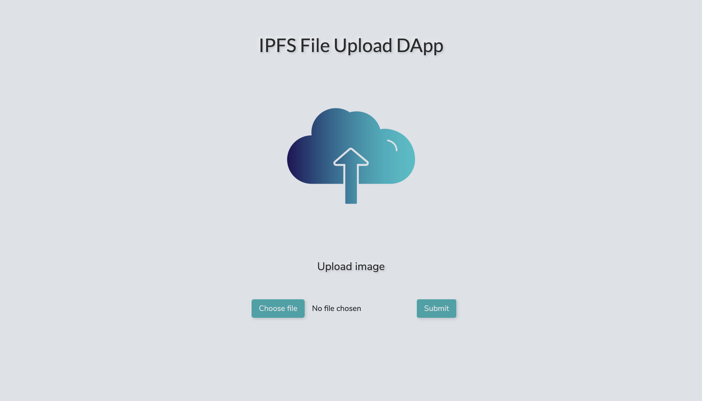

# IPFS_File_Upload

 

<a href="https://youtu.be/yPyeE4g-bSE">YouTube</a>

This project works on Smart Contracts that stores any file on the blockchain using IPFS technology. The Inter Planetary File System (IPFS) uses content-addressing to uniquely identify each file in a global namespace connecting all computing devices.

The system produces a unique hash for the image and stores it on the blockchain and uploads the image to IPFS at the same domain.

 
<b>Technologies used</b>

 
 

IPFS
 
Solidity
 
JavaScript
 
Truffle
 
Ganache
 
ReactJS
 
Web3
 
Metamask
 
BootStrap
